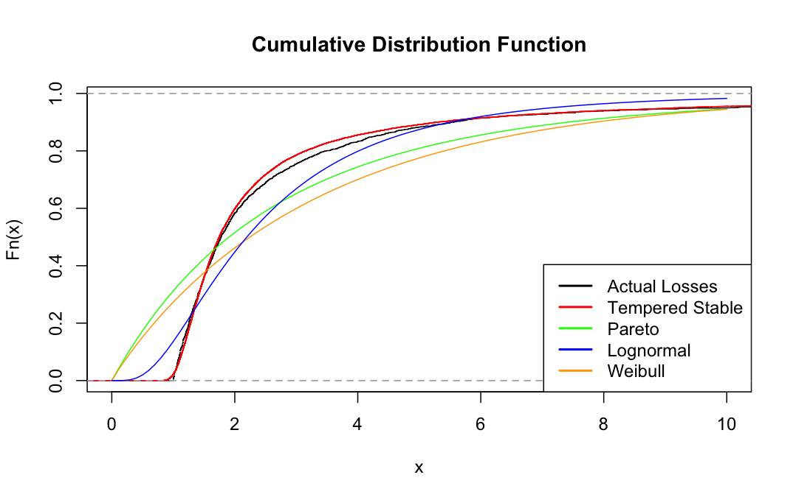
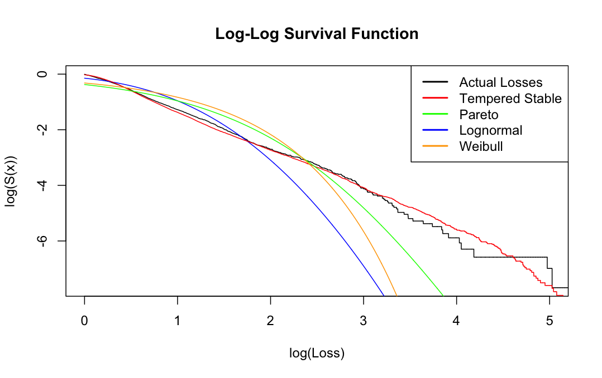

# Danish Reinsurance Loss Modeling with Tempered Stable Model

> A comparative feasibility study with the Danish fire reinsurance dataset

---

<table>
  <tr>
    <td><b>Figure 1: Cumulative Distribution Plot.</b></td>
    <td><b>Figure 2: Log-Log Survival Plot.</b></td>
  </tr>
  <tr>
    <td>
      
      <em>Visual indicator of body fit.</em>
    </td>
    <td>
      
      <em>Visual indicator of tail fit.</em>
    </td>
  </tr>
</table>

___

## Contents

1. [Motivation](#1-motivation)
2. [Results](#2-results)
3. [Limitations](#3-limitations)
4. [Future Directions](#4-future-directions)

---

## 1. Motivation

---

## 2. Results

### Parameter Estimation

| Parameter | Description | MoM Estimate | MLE Estimate |
|:---|:---|---:|---:|
| `α` | Stability index | 0.8450893 | 0.8354441 |
| `δ` | Scale | 0.2624210 | 0.2666983 |
| `λ` | Tempering | 0.007245232 | 0.007270770 |

### Goodness-of-Fit Statistics

| Statistic | Weibull | Lognormal | Pareto | **Tempered Stable** |
|:---|---:|---:|---:|---:|
| Kolmogorov–Smirnov (P-value) | 0.2851869 (5.74e-77)| 0.1365944 (5.52e-18) | 0.3114905 (9.73e-92) | **0.03137979** (**0.24**) |
| Anderson–Darling (P-value) | 	1,152,499.37 (2.5e-04)| 375,209.78 (2.5e-04) | 1,188,175.61 (2.5e-04) | **17,669.24** (**0.09**) |
| AIC | 9,611.24 | 8,119.79 | 9,249.67 | **6,869.06** |
| BIC | 9,622.61	 | 8,131.16 | 9,261.03 | **6,886.10** |
| Negative Log-Likelihood | 4,803.62 | 4,057.90 | 	4,622.83 | **3,431.53** |

### Aggregate Loss Simulation — Tail Value at Risk (millions DKK)

| Confidence | Weibull | Lognormal | Pareto | **Tempered Stable** |
|:---|---:|---:|---:|---:|
| 90% | 784.5450 | 652.0194 | 755.8840 | **926.1195** |
| 95% | 808.1441 | 669.2237 | 780.4087 | **1000.5268** |
| 99% | 854.6111 | 704.1185 | 833.1602 | **1197.8941** |

---

## 3. Limitations

### **Single dataset scope.**
The analysis was conducted on one dataset covering one country, one peril, and one historical period (Denmark, fire, 1980–1990). Replicability across different lines of business and loss characteristics remains to be established.

### **Simulation-based goodness-of-fit testing.**
Goodness-of-fit testing (Kolmogorov-Smirnov, Anderson-Darling) relied on a two-sample simulation approach rather than direct CDF evaluation. This is because a CDF evaluation would require inversion of the characteristic function via fast Fourier transform followed by numerical integration, a slow and computationally expensive process. Simulation of tempered stable quantities is relatively quick via accept-reject sampling with stable quantities generated exactly using the Chambers, Mallows and Stuck method. This introduces additional variance. As such these values should be interpreted as relative rankings across models.

### **Full-range Pareto benchmark.**
The Pareto model was fitted via full-range MLE rather than threshold-based GPD fitting, likely understating its true tail performance.

### **Frequency model sensitivity.**
A Poisson model was selected as the frequency component for aggregate loss simulation. Another model such as negative binomial may be more appropriate, although this was not thoroughly investigated. 

---

## 4. Future Directions

### **Uncertainty quantification.**
Provide confidence intervals for parameter estimates and test statistics to diagnose reliability.

### **POT/GPD as a comparative benchmark.**
Fit generalized Pareto distribution using stability-plot threshold selection, yielding a more rigorous heavy-tail benchmark.

### **Alpha-stable as a comparative benchmark.**
It may also be worthwhile to fit a classical alpha-stable model as this provides another heavy-tail benchmark.

### **Reinsurance layer pricing.**
Complete the pricing analysis across a full tower of excess-of-loss layers, translating distributional findings into a reinsurance pricing workflow. 

### **Multi-dataset replication.**
Apply the pipeline to additional datasets to establish replicability across lines of business and loss characteristics.

---

## References

- Massing, T. (2024). *Parametric Estimation of Tempered Stable Laws*. arXiv:2303.07060v4 \[math.ST\]. University of Duisburg-Essen. https://arxiv.org/abs/2303.07060
- Rosinski, J. (2007). Tempering stable processes. *Stochastic Processes and their Applications*, 117(6), 677–707.
- Küchler, U. and Tappe, S. (2013). Tempered stable distributions and processes. *Stochastic Processes and their Applications*, 123(12), 4256–4293.

---

